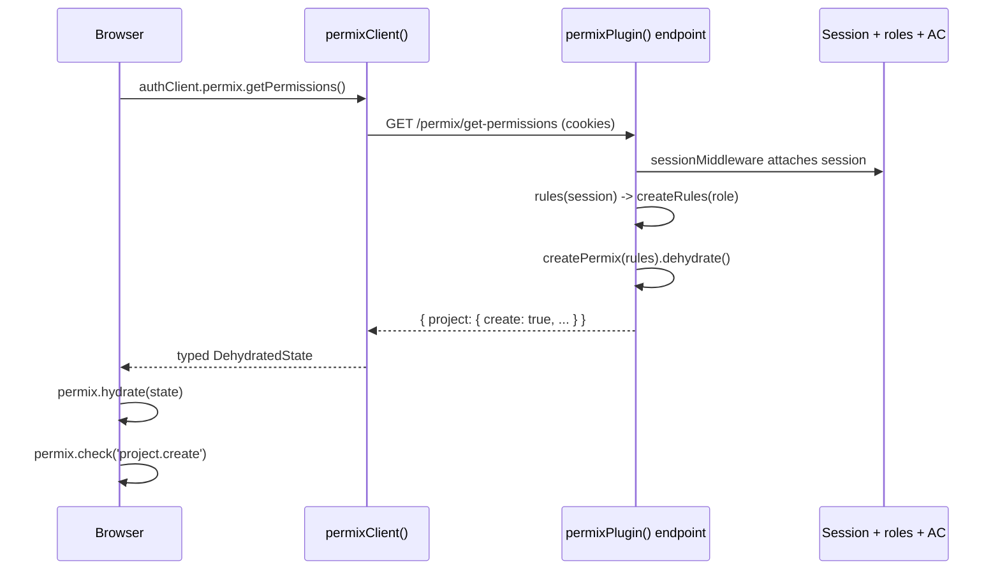

## Overview

Permix integrates with [Better Auth](https://www.better-auth.com/)'s access-control layer — the same `createAccessControl` / `newRole` primitives that power the **organization** plugin, the **admin** plugin, and any custom access-control setup. The integration derives a fully type-safe Permix statement from your `ac.statements` and lets you build rules from Better Auth roles via `createRules`.

<Callout>
Before getting started with the Better Auth integration, make sure you've completed the initial setup steps in the [Quick Start](/docs/quick-start) guide.
</Callout>

## How it works

A Permix instance is a typed container that holds one permissions snapshot. `setup(rules)` fills it, `check(path)` reads it, `dehydrate()` flattens it to JSON-safe booleans, and `hydrate(state)` loads a flattened snapshot back. By itself, it knows nothing about HTTP, sessions, or Better Auth.

The Better Auth integration adds two things on top:

- **Shape (compile time)** — `ac.statements` (e.g. `{ project: ['create', 'read', ...] }`) becomes the typed Permix statement. This is what makes `permix.check('project.create')` autocomplete and type-check.
- **Rules from roles (runtime)** — `permix.createRules('admin')` delegates to Better Auth's `role.authorize(...)` for each resource/action pair and returns a plain `Rules` object of booleans. It does not call `setup()` — you decide when and how to use the result.

The instance is **not** automatically bound to any request. There are two ways to connect it:

- **Server-side checks** — read the session yourself, call `setup(createRules(role))`, then `check()`. No plugins needed.
- **Client-side checks** — the server computes the snapshot and sends flattened booleans to the browser via an HTTP endpoint. The browser hydrates them and calls `check()` locally. This is what the server and client plugins provide.

The transport flow for client-side checks:



The browser must not recompute permissions — it doesn't have the trusted role data, and you don't want to ship the access-control logic to the client. The **server plugin** owns the logic and serializes booleans; the **client plugin** is type-only glue that exposes a typed `authClient.permix.getPermissions()` and keeps server-only code (`better-auth/api`) out of the browser bundle.

<Steps>

<Step>

## Define Access Control

Set up your access control statements and roles using Better Auth's `createAccessControl`. If you're using the organization plugin, merge `defaultStatements` and the built-in role statements.

```ts title="auth/permissions.ts"
import { createAccessControl } from 'better-auth/plugins/access'
import {
  adminAc,
  defaultStatements,
  memberAc,
  ownerAc,
} from 'better-auth/plugins/organization/access'

export const statement = {
  ...defaultStatements,
  project: ['create', 'read', 'update', 'delete'],
} as const

export const ac = createAccessControl(statement)

export const member = ac.newRole({
  ...memberAc.statements,
  project: ['read'],
})

export const admin = ac.newRole({
  ...adminAc.statements,
  project: ['create', 'read', 'update'],
})

export const owner = ac.newRole({
  ...ownerAc.statements,
  project: ['create', 'read', 'update', 'delete'],
})

export const roles = { member, admin, owner }
```

</Step>

<Step>

## Create a Permix Instance

Pass your access-control instance (or raw statements) and your named roles map to `createPermix`. The Permix statement is derived from `ac.statements` automatically.

```ts title="auth/permix.ts"
import { createPermix } from 'permix/better-auth'
import { ac, roles } from './permissions'

export const permix = createPermix(ac, { roles })
```

</Step>

<Step>

## Build Rules from Roles

Use `permix.createRules(role)` to convert one or more Better Auth roles into a typed `Rules` object, then pass it to `setup()`.

```ts
import { permix } from './auth/permix'

// Single role name
permix.setup(permix.createRules('admin'))

// Multiple roles — permissions are unioned
permix.setup(permix.createRules(['member', 'admin']))

// Role object directly
import { admin } from './auth/permissions'
permix.setup(permix.createRules(admin))
```

</Step>

<Step>

## Check Permissions

Once rules are set up, use the standard Permix `check()` API.

```ts
permix.check('project.create') // true for admin/owner
permix.check('project.delete') // true for owner only
permix.check('organization.update') // from org defaultStatements

// Compose checks
permix.check(c => c('project.read') && c('member.create'))

// Subtree aggregation
permix.check('project.~any') // any project permission?
permix.check('project.~all') // all project permissions?
```

</Step>

<Step>

## Override and Compose

Since `createRules` returns a standard `Rules` object, you can spread it with overrides, use it with `template()`, or `dehydrate()` for SSR.

```ts
// Override specific permissions
permix.setup({
  ...permix.createRules('member'),
  project: { create: false, read: true, update: false, delete: true },
})

// Reusable templates
const adminTemplate = permix.template(permix.createRules('admin'))
permix.setup(adminTemplate())

// SSR: dehydrate on server, hydrate on client
permix.setup(permix.createRules('admin'))
const state = permix.dehydrate()
// send `state` to the client...
```

</Step>

<Step>

## Server Integration (server-side checks)

If you only need to check permissions on the server, no plugins are required. Read the session yourself, call `setup()` with the role-derived rules, and `check()`. In a concurrent server, call `setup()` per request rather than relying on a shared module-level instance.


```ts
import { auth } from './auth'
import { permix } from './auth/permix'

// Organization plugin: get the active member's role
const activeMember = await auth.api.getActiveMember({
  headers: await headers(),
})
permix.setup(permix.createRules(activeMember.role))

// Admin plugin: use session user role
const session = await auth.api.getSession({
  headers: await headers(),
})
permix.setup(permix.createRules(session.user.role))

// Then check anywhere
if (permix.check('project.update')) {
  // allowed
}
```

</Step>

<Step>

## Server Plugin (client-side checks)

When the browser also needs `permix.check()`, use `permixPlugin` to add a `GET /permix/get-permissions` endpoint to your Better Auth server. The plugin runs a `rules` callback with the current session and returns dehydrated permissions. Both the server and client plugins are optional — only add them when you need client-side permission checks.

```ts title="auth.ts"
import { betterAuth } from 'better-auth'
import { organization } from 'better-auth/plugins'
import { permixPlugin } from 'permix/better-auth'
import { ac, roles } from './auth/permissions'
import { permix } from './auth/permix'

export const auth = betterAuth({
  plugins: [
    organization({ ac, roles }),
    permixPlugin({
      rules: ({ user }) => permix.createRules(user.role),
    }),
  ],
})
```

The `rules` callback receives the full Better Auth session, so you can use any session data to build permissions — not just roles:

```ts
permixPlugin({
  rules: async (session) => {
    // Custom logic: combine role-based rules with overrides
    const baseRules = permix.createRules(session.user.role)
    return {
      ...baseRules,
      project: { ...baseRules.project, delete: session.user.isOwner },
    }
  },
})
```

</Step>

<Step>

## Client Plugin

Use `permixClient` on the client to get a typed method for fetching permissions from the server endpoint.

```ts title="auth-client.ts"
import { createAuthClient } from 'better-auth/client'
import { permixClient } from 'permix/better-auth/client'

export const authClient = createAuthClient({
  plugins: [permixClient()],
})
```

Then fetch and hydrate permissions on the client:

```ts
import { authClient } from './auth-client'
import { permix } from './auth/permix'

const { data: state } = await authClient.permix.getPermissions()
permix.hydrate(state)

permix.check('project.create') // type-safe check
```

</Step>

</Steps>

## Notes

- The integration works with the **organization** plugin, the **admin** plugin, and any custom `createAccessControl(...)` — they all share the same `Statements` / `Role` primitives.
- When multiple roles are passed to `createRules`, their permissions are **unioned**: an action is allowed if **any** role grants it.
- `createRules` produces plain booleans, so `dehydrate()` / `hydrate()` and SSR work out of the box.
- Better Auth is declared as an optional peer dependency. You only need to install it if you plan to use `permix/better-auth`.
- The permission keys match the resource names in your statements object (e.g. `project`, `organization`, `member`).
- A Permix instance holds a single snapshot. In a concurrent server, call `setup()` per request (or create a per-request instance) instead of relying on module-global state. The `permixPlugin` endpoint already does this — it builds a fresh instance for every request.
- The server + client plugins are only needed when the browser performs `check()`. Pure server-side checks require just `createPermix` + `setup`.
